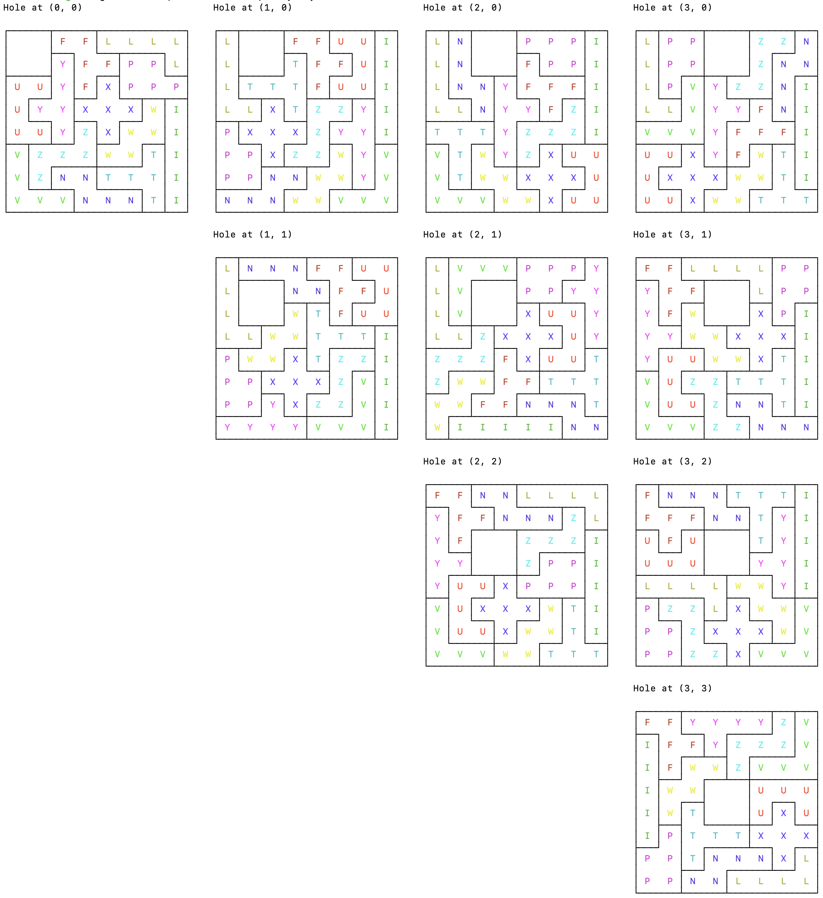

# Pips Solver, 8x8-2x2 Mechanical Proof, and Poly Pips Game Concept
Last updated 2025-10-27.

This project contains three subprojects:

- The *Pips Solver* is a human-specified solver for the NY Times Pips game with implementations coded by [Gemini Pro 2.5](https://deepmind.google/models/gemini/pro/), [Claude Sonnet 4.5 Code](https://www.claude.com/product/claude-code), and [OpenAI Codex 5](https://chatgpt.com/features/codex).
- The *8x8-2x2 Mechanical Proof* is a human-specified, human-guided, AI-implemented mechanical proof of an assertion from [Polyominoes 101 - The Absolute Basics](https://www.polyominoes.com/101-the-absolute-basics/) that an 8x8 grid with a 2x2 square removed can be tiled with the 12 pentominoes (up to chirality).  This work was done by Claude Code.
- The *Polypips Game Concept* extends the concept of the Pips game to polyominoes, introduces a game generator that accepts various heuristics, and a solver.  As with the other work here, this was human-specified, human guided, and AI implemented.  This work was done by Codex 5.

These is more discussion about each of the subprojects in the sections below.

## Pips Solver Discussion
The specification is in [pips-solution-strategy.md](pips-solution-strategy.md), and my primary objective was to experiment with different AI models/agents and what it's like to work with them (and to have them work with each other).  I used the [Zed](https://zed.dev) editor for authoring, with a draft of the specification being written independently first and then iteratively improved through the initial work of implementing it via Gemini.

I worked through four stages:

1. Each AI coding agent implementing independently based on the specification.
2. Optimization of the algorithm with the agents critiquing and adapting code from each other.
3. Implementation of human-specified improvements (e.g., a heuristic for selecting the next move).
4. Further improvements (see the issues for the project) to output formatting (adapted from Brian Berns' [F# implementation](https://github.com/brianberns/Pips)), and pulling JSON games down directly with the agent integrated with Github via the [Github MCP](https://github.com/github/github-mcp-server/blob/main/docs/remote-server.md) ([`mcp-remote`](https://github.com/geelen/mcp-remote) presenting a `stdio` interface to Codex).  I only had Codex do this work, so the Claude and Gemini implementations don't have those improvements yet.

## Notes on Puzzles

The most interesting puzzles from a troubleshooting standpoint were the 2025-09-15 "hard" (due to the large single constraint) and the 2025-10-14 "hard" (due to the number and complexity of constraints).  Solving takes no more than ~30 seconds on my laptop.

The Codex solver has some enhancements to count the total number of solutions for a puzzle, and most puzzles have only one solution.  Of the 183 puzzles in examples:

- 131 puzzles (≈72%) have exactly one solution: easy 50, medium 44, hard 37.
- Remaining puzzles show small clusters of alternatives except for a handful ofhard cases with large branching factors.

The puzzles with the most solutions are:

- 2025-09-15 hard: 2,764,800 solutions
- 2025-10-05 hard: 344 solutions
- 2025-09-30 hard: 110 solutions
- 2025-09-04 hard: 86 solutions
- 2025-08-23 hard: 80 solutions

### Notes on Agents

These notes are primarily for the initial implementation and a couple of subsequent optimization/refinement passes.

#### Gemini 2.5 Pro
I used Gemini 2.5 Pro to make a first pass from within the Zed editor, interacting with the AI to build a working solver; net net, it was certainly faster than writing it on my own.  After making passes with Claude and Codex, I used Gemini 2.5 Pro again (but from the CLI this time) for a second pass after the refinements to the specification obtained through the interaction with the other models.

For the first pass, Gemini didn't do a great job following the instructions in the specification, and it was aboslutely the most "YOLO" in terms of writing tests and explaining its thinking.

#### Claude Sonnet 4.5 + Code
I used Claude Sonnet 4.5 via the Claude Code CLI (at the cost of around 8% of a week's usage limit for a Pro plan), and it did a superlative job.  It found both subtle and unsubtle issues in the specification, and it produced well-tested code in the format and style that I requested.

Interestingly, the solver was 4-5x as fast as the Gemini solver once it identified (and implemented) a performance optimization by reading the Gemini code.

#### Codex 5
I used GPT Codex 5 (at the cost of around 500k total tokens) for another pass, and it also did a great job, including finding some subtle and unsubtle issues with the specification that both Claude and Gemini had missed.  Interestingly, when I asked it to critique the other two implementations, it complained that they correctly implemented the specification in a way that Codex had missed!  (Codex admitted the error once prompted.)  Codex produced well-tested code in the format and style that I requested.  The Codex solver is about twice as fast as the Gemini solver (and thus half as fast as the Claude solver).

#### Initial Wrap Up
I asked each of the models to compare/contrast the code from all three models after the initial round, and Claude did a decent job of summarizing:

> Summary
> - Codex: Verbose and explicit with extensive helpers and validation
> - Claude: Balanced OOP approach with good encapsulation via play()
> - Gemini: Minimal functional style with compact representations
> All three are correct implementations with similar algorithmic approaches but different stylistic choices and ownership strategies.  Codex is the most "enterprisey" with extensive validation and helpers, Claude takes a balanced OOP approach, and Gemini favors minimalism and functional patterns.

None of the models did some of the things that I would have expected them to do without additional prompting and review, e.g., use persistent data structures for the recursion.  None of the models proposed an obvious(?) performance improvement presented by the 2025-09-15 "hard" game, which was to optimize the pivot point selection based on the size of the remaining constraints.  They all did a fine job of implementing these improvements once I pointed them out.  The persistent data structure improvement is probably an instance of operator error/ignorance, in that I *could* have supplied that as part of the prompt/specification if I'd better understood the level of flexibility around mutable data structures in Rust.  The point selection optimization is a more interesting question.  None of the AIs thought "outside the box" in this way.

Both of those improvements (especially the code/implementation style one) are good candidates to fold back into an improved specification.

### Cost Considerations
On my first pass using Gemini from Zed, I provisioned an API key in Google Cloud, assigned it to the non-free tier, and that resulted in a cost of around $35 for the work.  That's great compared to the cost of human labor, but it's nearly double the monthly $20 subscription costs for either Claude or Codex.  For the second pass using Gemini from the commandline, I authenticated to Google and used the Gemini subscription from my Google account.

### Acknowledgments / References
Discovering and reviewing the code for another Pips solving project, [pips](https://github.com/ematth/pips), I discovered that a JSON representation of the games is downloadable from the NY Times API; this helped to bulk up the set of examples.  The 2025-09-15 "hard" game is the most interesting because of the large `Exactly` constraint.

There's a [cool approach](https://www.righto.com/2025/10/solve-nyt-pips-with-constraints.html) using a constraint solver from Ken Shirriff, too, and this [F# implementation](https://github.com/brianberns/Pips) that has a slick output style.

### Examples
To experiment with the solvers, there are a number of examples (in [examples/](examples)) pulled from the NYTimes, or the Codex solver is updated to pull the games from the NYTimes by date and difficulty:

```
% solve_pips 2025-10-15 hard
Solving 2025-10-15 Hard

┌───┬───────┐
│ 8 │ 2     │
│   ├───┬───┤       ┌───┐
│   │   │ 4 │       │>3 │
├───┴───┤   │       ├───┤
│10     │   │       │ 0 │
├───┬───┴───┘       │   │
│ 4 │               │   │
├───┤               │   │
│>1 │               │   │
└───┼───┬───────┐   └───┘
    │ 9 │ 2     │
    │   ├───┬───┤       ┌───┬───┐
    │   │   │ 1 │       │ = │ 0 │
    ├───┼───┤   │       │   ├───┘
    │12 │ 3 │   │       │   │
    │   ├───┴───┘       ├───┤
    │   │               │ = │
    ├───┤           ┌───┘   │
    │ 2 │           │       │
    └───┘           └───────┘

Dominoes:

0-0   0-1   0-2   0-3   0-6   1-3   1-4   1-5
2-3   2-4   2-5   2-6   3-3   4-5   4-6

1: (2, 4) @ (0, 3) heading North
2: (2, 6) @ (1, 8) heading North
3: (4, 6) @ (1, 6) heading South
4: (2, 5) @ (1, 5) heading West
5: (0, 3) @ (2, 7) heading West
6: (0, 1) @ (3, 5) heading South
7: (0, 6) @ (5, 1) heading North
8: (0, 2) @ (6, 6) heading West
9: (2, 3) @ (6, 7) heading South
10: (1, 4) @ (0, 0) heading West
11: (4, 5) @ (0, 1) heading South
12: (1, 5) @ (1, 2) heading West
13: (1, 3) @ (2, 0) heading South
14: (0, 0) @ (5, 3) heading North
15: (3, 3) @ (5, 9) heading East

Found a solution in 8.206167ms
┌───────┬───┐
│ 4   1 │ 1 │
├───┬───┤   │       ┌───┐
│ 4 │   │ 3 │       │ 6 │
│   ├───┴───┤       │   │
│ 5 │ 5   1 │       │ 0 │
├───┼───────┘       ├───┤
│ 4 │               │ 0 │
│   │               │   │
│ 2 │               │ 0 │
└───┼───────┬───┐   └───┘
    │ 5   2 │ 0 │
    ├───┬───┤   │       ┌───────┐
    │ 4 │   │ 1 │       │ 2   0 │
    │   ├───┴───┤       ├───┬───┘
    │ 6 │ 3   0 │       │ 2 │
    ├───┼───────┘       │   │
    │ 6 │               │ 3 │
    │   │           ┌───┴───┤
    │ 2 │           │ 3   3 │
    └───┘           └───────┘
```

(Be sure to build with the `--release` flag is critical for larger puzzles.)

## 8x8-2x2 Mechanical Proof Discussion

The spec [8x8-2x2-mechanical-proof.md](8x8-2x2-mechanical-proof.md) reduces the 49 possible cases to 7 up to symmetry and then uses a backtracking solver to find a tiling that meets the requirements of the problem.  This work was given to Claude, along with some successive enhancements to produce pretty, colorized output.



## Polypips Game Concept Discussion

The spec [poly-pips.md](poly-pips.md) lays out the concept and rules, so I'll just drop some eye candy here in the form of a generated game and a solver run to solve it.

```
board:
 ######
########
########
########
########
########
########
 ######

pieces: 12x5
constraints: any
constraint-coverage: 0.30
constraint-selection: uniform-size
seed: 12345
```

Which produces (with a little editing for brevity):

```
game:
    ┌───────────┬───────────┐
    │ ∅         │>9         │
┌───┘           └───────────┼───┐
│                           │=2 │
│       ┌───────┐           └───┤
│       │<25    │               │
├───────┘   ┌───┘               │
│           │                   │
├───┬───────┼───┐       ┌───┐   │
│=1 │ ∅     │ 9 │       │>1 │   │
│   └───────┤   └───┐   └───┘   │
│           │       │           │
│   ┌───────┼───┐   │           │
│   │       │ 4 │   │           │
└───┤       └───┴───┘       ┌───┘
    │                       │
    └───────────────────────┘

pieces:
5F-:40461,5V:02341,5W:12143,5P-:50530,5N-:13112,5Y+:32346,
5Z+:11332,5L-:20245,5U:42111,5T:42402,5X:11230,5I:22664
```

And the solution:

```
Found a solution in 4.896125ms

    ┌───┬───────────┬───────┐
    │ 1 │ 1   4   3 │ 3   4 │
┌───┤   └───────┐   ├───┐   └───┐
│ 0 │ 6   4   0 │ 2 │ 1 │ 1   2 │
│   └───┐   ┌───┤   │   └───┐   │
│ 5   3 │ 4 │ 3 │ 0 │ 3   1 │ 1 │
│       ├───┘   ├───┴───┐   ├───┤
│ 5   0 │ 6   2 │ 1   1 │ 1 │ 2 │
├───────┴───┐   ├───┐   │   │   │
│ 1   2   4 │ 3 │ 2 │ 3 │ 2 │ 0 │
│   ┌───┐   │   │   │   └───┤   │
│ 1 │ 1 │ 1 │ 4 │ 0 │ 3   2 │ 2 │
├───┘   └───┼───┘   └───┬───┘   │
│ 1   2   3 │ 4   2   4 │ 5   4 │
└───┐   ┌───┴───────────┴───┬───┘
    │ 0 │ 2   2   6   6   4 │
    └───┴───────────────────┘
```
